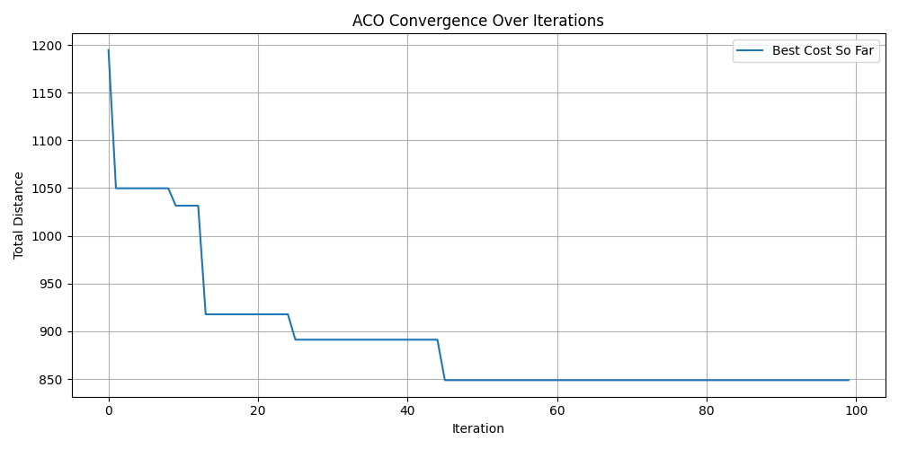
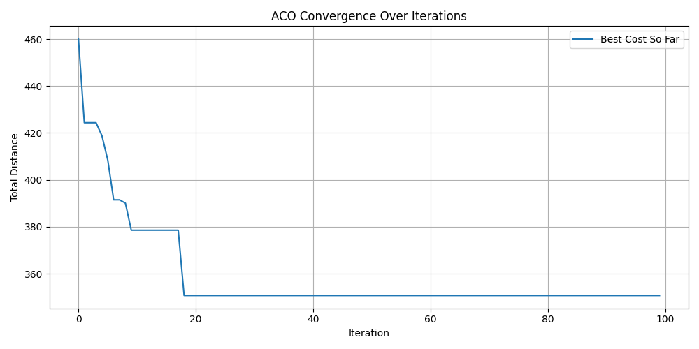
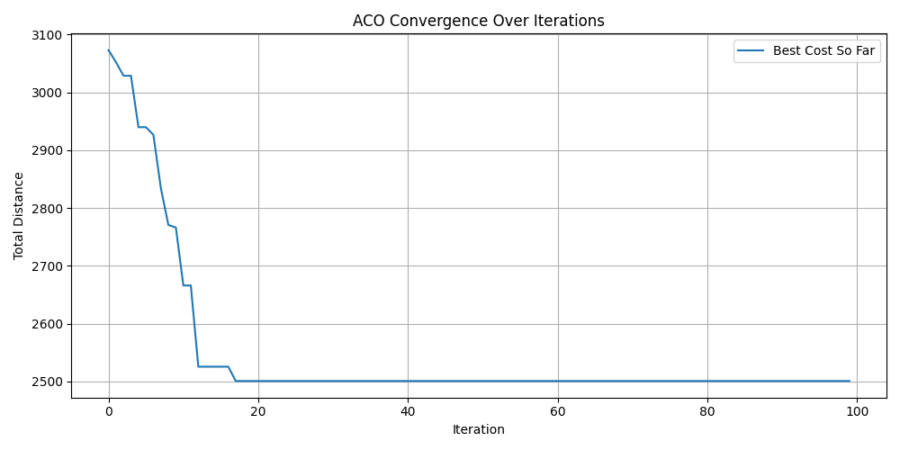

#  Vehicle Routing Problem using Ant Colony Optimization (ACO)

## Description

This project solves a simplified version of the **Vehicle Routing Problem (VRP)** using the **Ant Colony Optimization (ACO)** algorithm, adapted from a TSP tutorial.

In this problem:
- There is one central depot
- A fleet of identical vehicles (unlimited)
- Each customer has a specific demand
- Vehicles have limited capacity

The goal is to:
- Deliver all shipments
- Minimize total travel distance
- Use as few vehicles as possible

---


##  How to Run

### 1. Install dependencies:
```bash
pip install -r requirements.txt
```

### 2. Run the solver:
```bash
python main.py
```

## Results 
# 1. data_32.xml
```bash
Best Total Cost: 848.79

Vehicle 1: 1 -> 2 -> 17 -> 31 -> 27 -> 15 -> 25 -> 28 -> 1
Vehicle 2: 1 -> 21 -> 6 -> 26 -> 11 -> 16 -> 10 -> 23 -> 9 -> 19 -> 30 -> 1
Vehicle 3: 1 -> 8 -> 14 -> 22 -> 32 -> 18 -> 20 -> 1
Vehicle 4: 1 -> 29 -> 12 -> 5 -> 4 -> 3 -> 24 -> 7 -> 1
Vehicle 5: 1 -> 13 -> 1

```

# 2. data_72.xml
```bash
Best Total Cost: 350.71

Vehicle 1: 1 -> 37 -> 36 -> 15 -> 16 -> 20 -> 18 -> 13 -> 14 -> 17 -> 3 -> 19 -> 72 -> 7 -> 11 -> 6 -> 4 -> 10 -> 8 -> 5 -> 9 -> 62 -> 61 -> 63 -> 65 -> 66 -> 64 -> 59 -> 60 -> 69 -> 40 -> 42 -> 1
Vehicle 2: 1 -> 34 -> 33 -> 32 -> 35 -> 57 -> 58 -> 56 -> 55 -> 26 -> 25 -> 27 -> 24 -> 21 -> 44 -> 43 -> 45 -> 54 -> 51 -> 1
Vehicle 3: 1 -> 30 -> 31 -> 22 -> 23 -> 29 -> 28 -> 52 -> 50 -> 48 -> 71 -> 49 -> 46 -> 47 -> 53 -> 70 -> 38 -> 39 -> 41 -> 68 -> 67 -> 1
Vehicle 4: 1 -> 12 -> 2 -> 1

```


# 3. data_422.xml
```bash
Best Total Cost: 2500.69

```
